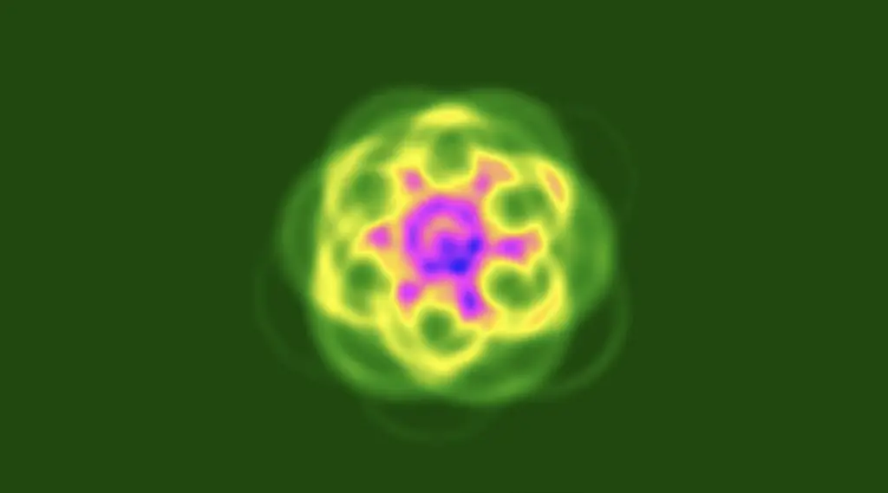
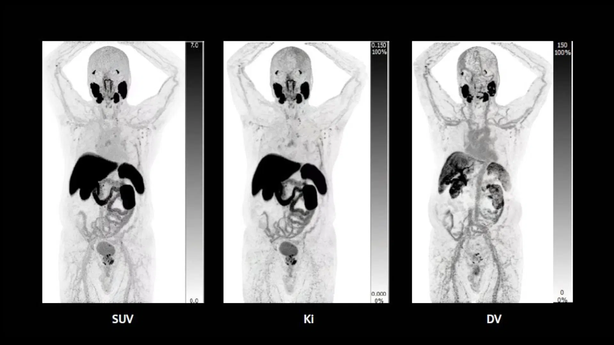
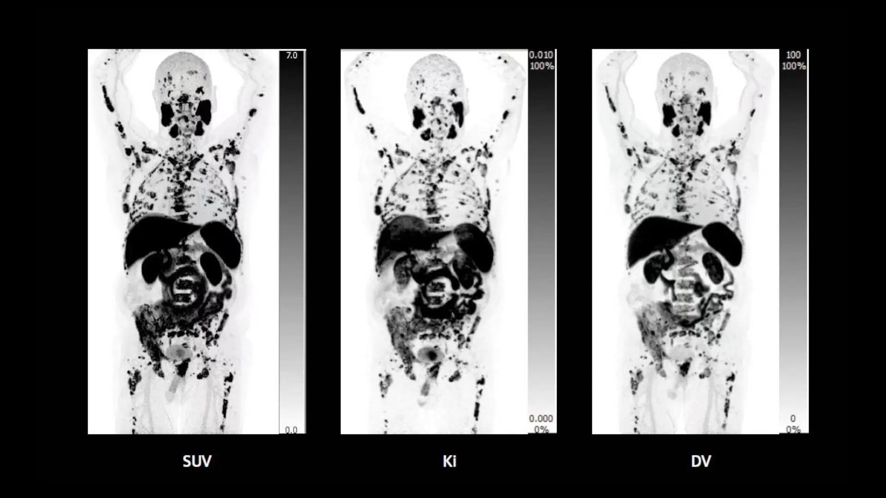
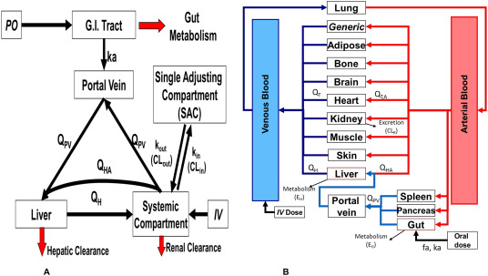

# Artificial Life: From Conway’s Game of Life to Modeling the Human Body

An automata from Lenia

For a long time, my drafts have included the term “[Artificial Life](https://en.wikipedia.org/wiki/Artificial_life)” or “ALife,” and I’ve always wanted to write about it. Today, I finally found the time. Since the early days of my personal blog, thinking about artificial forms of life has fascinated me, and through one of my friends, I became familiar with [Conway’s Game of Life](https://playgameoflife.com/). The basic idea of this game is very simple: in a two-dimensional space with an infinite grid of cells, you can activate any cells you want at the start and then press “start.” Based on four simple rules, cells turn on or off, and you can observe how different patterns evolve over time. The four rules are as follows:

- Any live cell with fewer than two live neighbors dies (underpopulation).
- Any live cell with more than three live neighbors dies (overcrowding).
- Any live cell with two or three live neighbors survives and moves to the next generation.
- Any dead cell with exactly three live neighbors becomes alive again.

A single Gosper’s glider gun creating gliders

The world of artificial life is incredibly exciting, and even a quick search on Wikipedia can provide interesting insights and introduce you to small and large examples as well as ambitious projects. At the beginning of this article, you can see an example pattern created by [Lenia](https://chakazul.github.io/Lenia/JavaScript/Lenia.html), which is a more advanced version of Conway’s Game of Life.

Recently, I have entered the world of kinetic modeling in PET imaging, and while it may seem a bit unusual at first, I see it as an opportunity to continue exploring artificial life. Among the concepts I’ve encountered, PBPK modeling is particularly relevant. PBPK, or [Physiologically Based Pharmacokinetic Modeling](https://en.wikipedia.org/wiki/Physiologically_based_pharmacokinetic_modelling), is a relatively new approach that uses radiotracers and kinetic modeling to represent the relationships between tissues and organs in the body. In other words, it tries to transform each cell and tissue of the body into a computational model so that we can make more reliable decisions about drug doses and their effects on the body, and adjust doses for organs and tumors using the principles of [dosimetry](https://en.wikipedia.org/wiki/Dosimetry). With the expansion of nuclear medicine, the importance of this field is growing and becoming more complex. For those unfamiliar with nuclear medicine, PET images may look similar at first glance, but each contains unique information that is useful for diagnosis and prognosis.

Parametric images created through kinetic modeling compared to SUV images

Parametric images created through kinetic modeling compared to SUV images

For a long time, many nuclear medicine imaging methods were based on SUV, or [Standardized Uptake Value](https://en.wikipedia.org/wiki/Standardized_uptake_value). This means the images were semi-parametric and could only provide a relative idea of how different regions compare. In kinetic modeling, however, using multiple dynamic scans over time and selecting a reference region allows the creation of parametric images. This approach provides more detailed information about the patterns observed in PET scans and enables more precise decision-making. Several studies have demonstrated the superiority of these methods over SUV-based approaches for diagnosis and prognosis, yet this field remains relatively new and has much room for development.

A schematic of a PBPK model taken from this article

There are many approaches to kinetic modeling, such as compartmental models and graphical models like Patlak and Logan. PBPK models are more complex and have mainly been used in pharmacology, though there have also been attempts to apply them in dosimetry. Explaining PBPK models fully in a short text is not feasible, but reading further online can give a deeper understanding. In general, these models allow us to convert the human body into a computational model using radiotracers—something that could potentially pave the way for a form of artificial life on a human scale in the future.

[Ref1](https://www.siemens-healthineers.com/fi/molecular-imaging/news/biograph-vision-quadra-pet-ct-multiparametric)
[Ref2](https://www.hug.ch/sites/interhug/files/structures/pinlab/documents/PETClinics2007_KineticModeling.pdf)
[Ref3](https://www.allucent.com/resources/blog/what-difference-between-pbpk-and-poppk-modeling)

[back](./)
