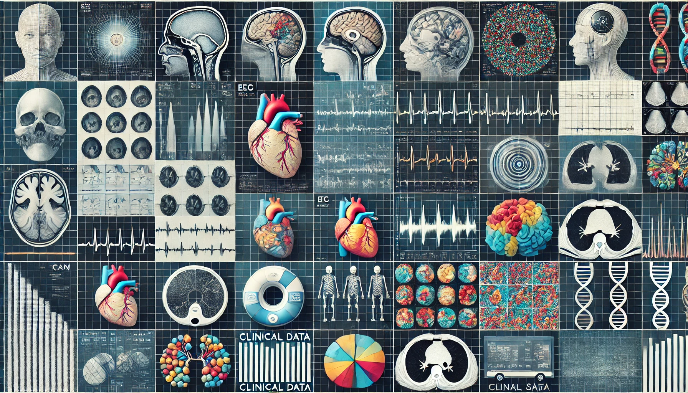

# The Utopia of Artificial Intelligence in Medicine

In previous posts, I’ve discussed various breakthroughs and tools in artificial intelligence that are helping transform the world of medical science and healthcare. Today, I want to dive into a concept that, when executed correctly, could revolutionize this field and unleash the full potential of AI.

## Large Language Models

It hasn’t been long since large language models [LLMs](https://en.wikipedia.org/wiki/Large_language_model). like ChatGPT were introduced, yet in this short time, we’ve all witnessed the immense power of AI firsthand. However, even before ChatGPT, if you were a tech enthusiast or someone into AI, you might have encountered services with similar capabilities. Early chatbots, often trained on limited datasets using natural language processing [NLP](https://en.wikipedia.org/wiki/Natural_language_processing) and natural language generation [NLG](https://en.wikipedia.org/wiki/Natural_language_generation) technologies, were designed to handle specific tasks—like helping you place an order online. The main limitation, though, was their narrow focus. For example, while these bots could help you navigate from the payment page to your cart, they’d struggle to answer unrelated questions, like the temperature at the center of the sun.
Large language models solved this issue. With architectures like [transformers](https://en.wikipedia.org/wiki/Transformer_(deep_learning_architecture)) and training on massive datasets, these models can talk, analyze, reason, and provide human-readable responses on almost any topic.

## Foundation Models

LLMs are actually a subset of a broader category called [foundation models](https://en.wikipedia.org/wiki/Foundation_model). These are machine learning or deep learning algorithms trained on vast amounts of data and can be used across a wide range of tasks. Essentially, you’re dealing with a model that has a large number of parameters—more than 1.7 trillion in the case of GPT-4. But LLMs aren’t the only kind of foundation models. For instance, services like [DALL-E](https://en.wikipedia.org/wiki/DALL-E) do the same for images, using large visual models (LVMs). At a higher level, multimodal models (LMMs) learn from diverse data types such as images, audio, video, and text, making them capable of solving a broader array of tasks. This is what happened with ChatGPT, it gradually evolved from a language model to a multimodal model, now able to analyze and generate both images and sounds.

## A Medical Example

Whenever AI advances, there’s always a question: how can this help the medical field? That’s why many organizations, including major players like Google, have started applying foundation models to healthcare. Google initially developed Med-PaLM1, a large language model trained to answer medical questions with approximately 70% accuracy. Later, they improved this to about 80% with Med-PaLM2. Then, they began incorporating other data types beyond text, leading to Med-PaLMM. Google’s scientists are now integrating this with their Gemini model, creating what’s called Med-Gemini. Below is a table that shows the data that was used to train Med-Gemini. Here is the link to the [research paper](https://arxiv.org/pdf/2405.03162) from Google

The dataset used to train these models spans various fields such as genomics, radiology, and pathology. As a result, the model can analyze and interpret, for example, a patient’s radiology scan with remarkable precision.

## The Big Race

Other companies are also racing to build their own multimodal models, using either fewer or more data sources, aiming to create AI systems that can serve the medical sector. The true winner of this race could profit significantly more than OpenAI did with ChatGPT, as the buyers here won’t be regular people but hospitals and companies willing to invest heavily in improving their operations, decision-making, and resource management.

That said, developing such foundation models isn’t as simple as fine-tuning them. One of the biggest challenges is the vast amount of data required. Due to security and access costs, acquiring large medical datasets is particularly difficult. OpenAI may have had the liberty to download vast amounts of internet data for training, but it’s not so easy to obtain patient data for model training.

I’ve always thought that one of the foundational steps towards creating powerful models in healthcare is reducing sensitivities around patient data and establishing infrastructures that regularly store anonymized patient data in a central database. Yet, these challenges make it clear that bringing such models into hospitals and doctors’ offices may still be a distant goal.

This might be the AI utopia we’re striving for—but we still have a long way to go.

[back](./)
