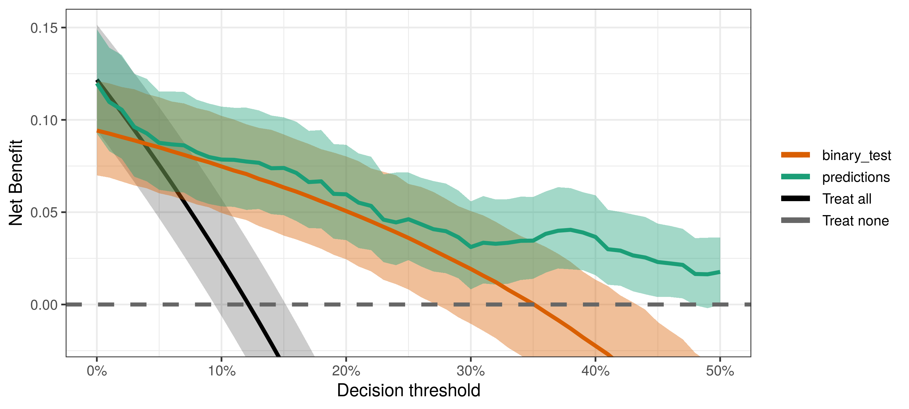
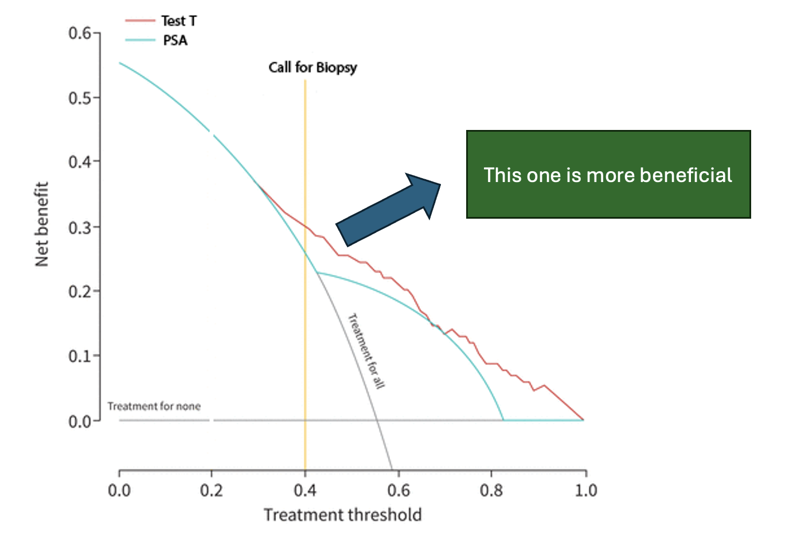

# Evaluating AI Models: Decision Curve Analysis (DCA)

Today, we have a variety of tools to evaluate the performance of AI models. From basic metrics like accuracy and AUC to more complex ones like calibration plots and precision-recall curves, each offers unique insights. However, some of these metrics better convey the information clinicians find most relevant, helping them quickly decide whether a model is practical for clinical use. For example, [Kaplan-Meier](https://en.wikipedia.org/wiki/Kaplan%E2%80%93Meier_estimator) curves illustrate how different models or interventions perform over time in a clinical setting.

Another valuable tool, which we’ll discuss in this post, is the Decision Curve Analysis (DCA).

## Introduction to DCA

DCA was introduced in 2006 by Dr. Vickers in [this](https://journals.sagepub.com/doi/10.1177/0272989X06295361) paper and has gradually gained traction in scientific research. Each year, its application in academic studies grows. However, learning about DCA can often be challenging. A quick internet search will lead you to either dense academic papers or scattered resources like YouTube videos—both of which can feel overwhelming.

Having studied this method for one of my projects, I aim to share what I’ve learned in a more accessible way. Let’s start with a basic definition:

## What is DCA?

> DCA is an analytical method for comparing models to determine whether a proposed model (often machine learning-based) offers greater net benefit in practice compared to existing clinical models.

To avoid delving into complex details immediately, let me explain its primary application through an example.

Example: Prostate Cancer Screening
Consider prostate cancer screening. One common test for early detection is the PSA test. However, urologists know that a positive PSA test result doesn’t necessarily mean cancer—it can yield false positives.

Here, the clinician must balance two priorities:

Ensuring patients who truly need a biopsy undergo the procedure.
Avoiding unnecessary biopsies in healthy individuals, as biopsy is an invasive process.
To achieve this, the doctor sets a threshold in their mind, say 40%. This means if the probability of cancer exceeds 40%, the patient is referred for a biopsy. While some healthy individuals might still undergo biopsies, the clinician believes the benefit of diagnosing cancer outweighs the harm of unnecessary biopsies.

Now, imagine you’ve developed a new test, Test T, which is more accurate than PSA. While it has higher accuracy and AUC, the key question remains: Does it perform better in clinical practice?

This is where DCA comes in. Its goal is to quantify the net benefit for patients—something other metrics don’t show effectively. Net benefit accounts for the harm caused by false positives and subtracts it from the benefit provided by true positives.

## DCA in Action

Let’s say you introduce Test T to the clinician, who still uses the same 40% threshold for decision-making. The clinician must choose between two models:

Model A: Predicts with 30% accuracy.
Model B (Test T): Predicts with 90% accuracy.
To make this decision, the clinician refers to a DCA plot. The plot shows that at their chosen threshold, Test T provides a higher net benefit for patients. As a result, the clinician opts to use Test T in practice.

## How Are DCA Plots Created?

DCA plots are based on a straightforward equation used to calculate net benefit at specific thresholds. By substituting values into this equation, net benefit can be computed and visualized.

Fortunately, you don’t need to do this manually. Libraries in R and Python make it easy to apply DCA to AI models and compare results against classical diagnostic methods. Some libraries I’ve worked with include [dcurves](https://cran.r-project.org/web/packages/dcurves/index.html) in R and [statkit](https://hylkedonker.gitlab.io/statkit/) in Python.

Recently, I discussed this topic in a session on MedX. Below is the recording of the session (in Persian).

<iframe width="560" height="315" src="https://www.youtube.com/embed/uByJJADL_WY?si=pho5329idCTITwLt" title="YouTube video player" frameborder="0" allow="accelerometer; autoplay; clipboard-write; encrypted-media; gyroscope; picture-in-picture; web-share" referrerpolicy="strict-origin-when-cross-origin" allowfullscreen></iframe>

[back](./)
